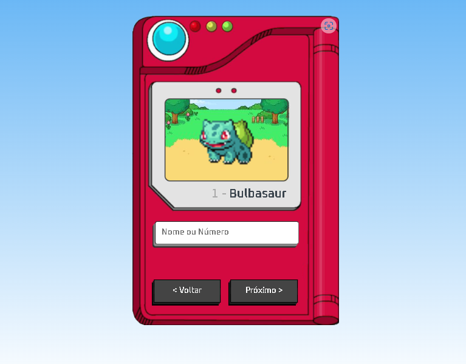

<h1 align="center">Pokédex</h1>

<h2 id="tecnologias" style="margin-top: 25px;">Tecnologias<h2>

Este projeto foi desenvolvido ultilizando: HTML, CSS, JavaScript consumido uma API da Pokeapi.

<h4>Veja como ficou. <a href="https://pokedex.iron-code.com/">Clique aqui</a></h4>
